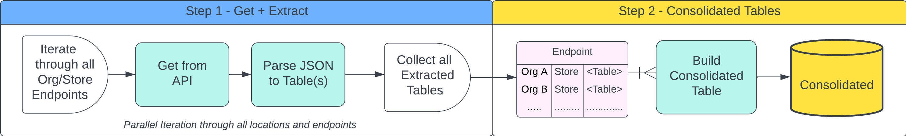

```{r report_init, echo = FALSE, include = FALSE}
library(pander)
library(lubridate)
library(rdleaflogix)
library(data.table)
library(stringr)
library(parallel)
library(pins)

Level <- NULL

knitr::opts_chunk$set(
  collapse = TRUE,
  comment = ""
)

sf <- function(x) format(x, format = "%H:%M:%S %P on %b %d, %Y")
report_start <- sf(now())

## initialize variables used in this report
dur <- NA
dur_get <- NA
dur_ext <- NA

log_sum <- NULL
  
n_success <- NA
n_errors <- NA
n_warns <- NA
  
n_get_success <- NA
n_get_errors <- NA
n_get_warns <- NA
  
n_ext_success <- NA
n_ext_errors <- NA
n_ext_warns <- NA

step1_status <- "❌"

customers_status <- "❌"
employees_status <- "❌"
orders_status <- "❌"
orderitems_status <- "❌"
loyalty_status <- "❌"
products_status <- "❌"

step_1_status_emoji <- "🤢"
step_1_stop <- sf(now())
STEP_1_OK <- FALSE
```

> This report is generated daily and runs the pipeline shown below. Last update at: **`r report_start`**

###### Summary of Report

This document executes and reports the status of a two-step pipeline that (1) gets/extracts raw data from the API, and (2) builds/writes consolidated tables to the database

{width="677"}

## Step I - Get and Extract

This report executes the code below to **Get and Extract** data for all Leaflogix client locations. This code returns all extracted data and the aggregated logs generated in this step.

```{r eval=FALSE}
r <- run_get_extract_ll(ncores = 16)
```

##### Execution Details

```{r exec_step_1, eval=TRUE, echo = FALSE, message=TRUE, error=TRUE}

r <- run_get_extract_ll(ncores = detectCores())

STEP_1_OK <- !is.null(r)

if (STEP_1_OK) {
  step_1_status_emoji <- "😁"
  step1_status <- "✅"
  
  logs <- setDT(r$logs)
  logs[, Detail.1 := stringr::str_to_title(Detail.1)]
  
  step_1_stop <- sf(logs[, max(TimestampUTC)])
  
  dur <- logs[, difftime(max(TimestampUTC), min(TimestampUTC), units = "sec")] |> round(2)
  
  dur_get <- logs[
    Detail == "GET", difftime(max(TimestampUTC), min(TimestampUTC), units = "sec")] |> round(2)
  
  dur_ext <- logs[
    Detail == "EXT", difftime(max(TimestampUTC), min(TimestampUTC), units = "sec")] |> round(2)
  
  log_sum <- dcast(
    logs[, .N, .(Level, ep = Detail.1)], Level ~ ep, fill = 0, value.var = "N")
  
  n_success <- logs[Level == "SUCCESS", .N]
  n_errors  <- logs[Level == "ERROR",   .N]
  n_warns   <- logs[Level == "WARNING", .N]

  n_get_success <- logs[Detail == "GET" & Level == "SUCCESS", .N]
  n_get_errors  <- logs[Detail == "GET" & Level == "ERROR",   .N]
  n_get_warns   <- logs[Detail == "GET" & Level == "WARNING", .N]
  
  n_ext_success <- logs[Detail == "EXT" & Level == "SUCCESS", .N]
  n_ext_errors  <- logs[Detail == "EXT" & Level == "ERROR",   .N]
  n_ext_warns   <- logs[Detail == "EXT" & Level == "WARNING", .N]
  
} else {
  step_1_stop <- sf(now())
}
```

> Execution status......`r step_1_status_emoji`
>
> Execution ended..... **`r step_1_stop`**

##### Summary of Log Events

|                      |  All Events   |    Get Events     |  Extract Events   |
|:---------------------|:-------------:|:-----------------:|:-----------------:|
| Total Run-Time       |  `r dur` sec  |  `r dur_get` sec  |  `r dur_ext` sec  |
| Total Success Events | `r n_success` | `r n_get_success` | `r n_ext_success` |
| Total Error Events   | `r n_errors`  | `r n_get_errors`  | `r n_ext_errors`  |
| Total Warning Events |  `r n_warns`  |  `r n_get_warns`  |  `r n_ext_warns`  |

##### Events By Endpoint

```{r sum_logs_step_1, echo = FALSE}

if (STEP_1_OK) {
  pander(log_sum, split.tables = Inf)  
} else {
  pander("Job Aborted...No Log Entries")
}
```

##### Error Details

```{r error_logs_step_1, echo = FALSE}

if (STEP_1_OK) {
  pander(logs[Level == "ERROR"], split.tables = Inf)
} else {
  pander("Job Aborted...No Log Entries")
}
```

## Step II - Build Consolidated

`Step 2` in this report executes the consolidated step in this pipeline. This step uses the extracted data from `Step 1` as its inputs, and produces output tables to land in database `consolidated`

The following code will consolidate data across all orgs and stores in this pipeline

```{r eval = FALSE}
customers  <- build_ll_customers(r$data)
employees  <- build_ll_employees(r$data)
orders     <- build_ll_orders(r$data)
orderitems <- build_ll_order_items(r$data)
loyalty    <- build_ll_loyalty(r$data)
products   <- build_ll_products(r$data)
```

###### Consolidated Customers

```{r exec_2_customers, echo = FALSE}
if (STEP_1_OK) {
  ferr <- function(c) return(NULL)
  customers  <- tryCatch(build_ll_customers(r$data), error = ferr)
  if (!is.null(customers)) customers_status <- "✅"
} 
```

###### Consolidated Employees

```{r exec_2_employees, echo = FALSE}
if (STEP_1_OK) {
  ferr <- function(c) return(NULL)
  employees  <- tryCatch(build_ll_employees(r$data), error = ferr)
  if (!is.null(employees)) employees_status <- "✅"
} 
```

###### Consolidated Orders

```{r exec_2_orders, echo = FALSE}
if (STEP_1_OK) {
  ferr <- function(c) return(NULL)
  orders     <- tryCatch(build_ll_orders(r$data), error = ferr)
  if (!is.null(orders)) orders_status <- "✅"
} 
```

###### Consolidated Order Lines

```{r exec_2_orderitems, echo = FALSE}
if (STEP_1_OK) {
  ferr <- function(c) return(NULL)
  orderitems <- tryCatch(build_ll_order_items(r$data), error = ferr)
  if (!is.null(orderitems)) orderitems_status <- "✅"
} 
```

###### Consolidated Loyalty

```{r exec_2_loyalty, echo = FALSE}
if (STEP_1_OK) {
  ferr <- function(c) return(NULL)
  loyalty    <- tryCatch(build_ll_loyalty(r$data), error = ferr)
  if (!is.null(loyalty)) loyalty_status <- "✅"
} 
```

###### Consolidated Products

```{r exec_2_products, echo = FALSE}
if (STEP_1_OK) {
  ferr <- function(c) return(NULL)
  products    <- tryCatch(build_ll_products(r$data), error = ferr)
  if (!is.null(products)) products_status <- "✅"
} 
```

```{r clean_up_job, echo = FALSE}
report_stop <- sf(now())
```

## Status Summary

| Step | Pipeline Step   | Inputs                | Outputs                  |        Status         |
|:------------:|:-------------|:-------------|:---------------|:------------:|
|  I   | Get and Extract | API Credentials       | Extracted Data           |   `r step1_status`    |
|  II  | Consolidation   | Extracted customers   | db.leaflogix_customers   | `r customers_status`  |
| III  | Consolidation   | Extracted employees   | db.leaflogix_employees   | `r employees_status`  |
|  IV  | Consolidation   | Extracted transaction | db.leaflogix_orders      |   `r orders_status`   |
|  V   | Consolidation   | Extracted transaction | db.leaflogix_order_lines | `r orderitems_status` |

> Report Complete: `r report_stop`
