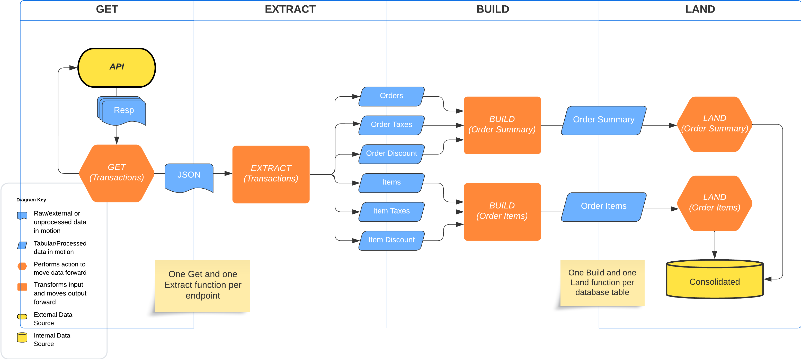

# rdleaflogix

<!-- badges: start -->
<!-- badges: end -->


## Pipeline Architecture



------------------------------------------------------------------------

### Basic Use Cases

#### Example

Get 10 Days of transactions and build Orders and Order Line Items:

```{r}
pos   <- "leaflogix"
org   <- "verano"
store <- "lawrencerec"
auth  <- ""
ckey  <- ""

x <- get_ll_transactions(org, store, auth, consumerkey, n = 10) |> 
  ext_ll_transactions(org, store) |> 
  extract_index()

order_items <- bld_ll_order_items(x)
order_summary <- bld_ll_order_summary(x)
```

#### Example

Get population data for org `Verano` and store `meriden`, append new order lines to integrated database

```{r}
arg <- get_leaflogix_index("verano", "meriden")

org   <- arg$org
store <- arg$store
auth  <- arg$auth
ckey  <- arg$consumerkey

pop <- pl_population(org, store, auth, ckey, write = TRUE)
```

> ##### Note on Argument `write (default FALSE)`
>
> Argument `write` to functions `pl_population` and `run_pl_population` (see next example), if set to TRUE will append new rows to the database table population. **The destination population table (`dev2.integrated.public.population`) has order line ID as a primary key.** Therefore, only new order lines will be appended for a given location (org/store) and day

#### Example

Run the full pipeline beginning with only the endpoints needed for population, and resulting in only new transaction lines getting added to population

```{r}
## run with default arg values 
## ncores = NULL, org = NULL, store = NULL, LB = FALSE
run_pl_population()

## New population rows appended for all 39 verano stores using 4 cores
run_pl_population(ncores = 4, org = "verano")

## Or just a single store
## Note, this is only 1 pipeline run. Since there is only one job to process, set ncores = 1
run_pl_population(ncores = 1, org = "verano", store = "...")
```

> ##### Note on default arguments to `run_pl_population()`
>
> Calling with argument defaults () will run all orgs/stores, checking first for the environmental variable **`N_CORES`** to determine number of cores to use, before falling back to total available cores on the system. Alternatively, directly specificy using the argument `ncores`
>
> The final return value is a single table that represents all the new order lines (population rows) for every org and location for the previous day. **Runs are distributed and processed in parallel, where 1 run represents the Get/Extract/Consolidate/and Build Population steps of the pipeline for a single org and store**

#### Example

Build an index table containing all clean brand names for a given leaflogix org and store

> Note this pipeline produces a table called `brand_index` using data retrieved from the endpoint `/brand`

```{r}
get_ll_brands(org, store, auth, consumerkey) |>
  ext_ll_brands(org, store) |>
  bld_ll_brand_index() |>
  wrt_ll_brand_index()
```

------------------------------------------------------------------------

## Package Structure

Using leaflogix to illustrate, the following describes structure of the exported functions that faciliate the pipeline diagramed above. Additionally, this also provide the guidelines to follow in developing new POS pipelines

### **API Endpoint**

Leaflogix endpoints define a unique pipeline run. The endpoints that we get data from are:

1.  `/reporting/transactions`
2.  `/reporting/inventory`
3.  `/inventory/snapshot`
4.  `/customer`
5.  `/brand`
6.  `/product`
7.  `/employee`
8.  `/brand`
9.  `/product-category`

> Every endpoint requires **one get and one extract function**. Get functions request data and move raw json data forward. Extract functions take a single json object and processes it into 1 or more tables

``` r
## For transactions endpoint:

raw_json  <- get_ll_transactions(org, store, auth, ckey)
extracted <- ext_ll_transactions(raw_json, org, store)
```

### Database Table

> Every eventual database table requires **one build function and one write function**. The build function takes all extracted datasets required to produce a single output table for the database, while the write function understands the requirements of landing the specific table given to it and writes to the database

``` r
## The extracted transactions tables are processed into two db tables

orderSumm <- bld_ll_order_summary(extracted)
orderItem <- bld_ll_order_items(extracted)

wrt_ll_order_summary(orderSumm)
wrt_ll_order_items(orderItem)
```

## Additional Helpers

``` r
# Lookup configured API credentials for all leaflogix locations:
read_leaflogix_creds()

# Get all arguments needed for a specific org (all stores and endpoints)
get_pipeline_args(pl, oid)
```

## Internal Execution

#### Parallelizing Pipelines

This is the internals to the function `run_pl_leaflogix` and illustrates the parallelization of the execution

``` r
```

***Proprietary - Do Not Distribute***
